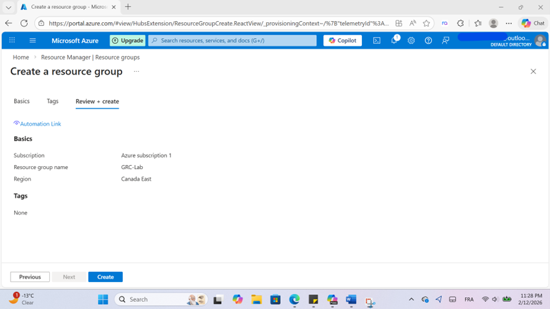
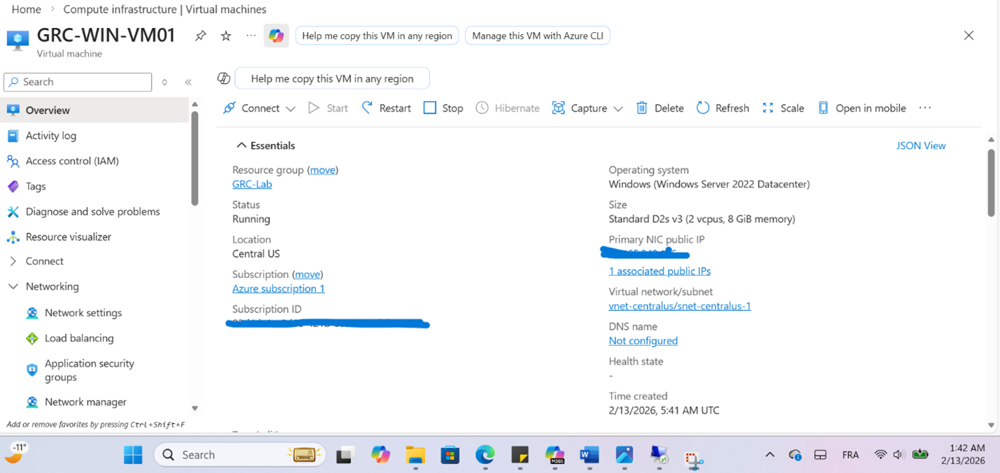
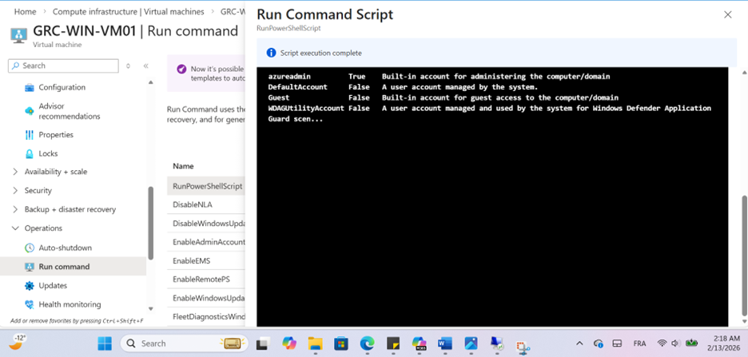
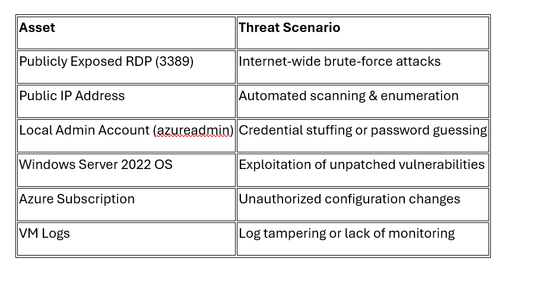
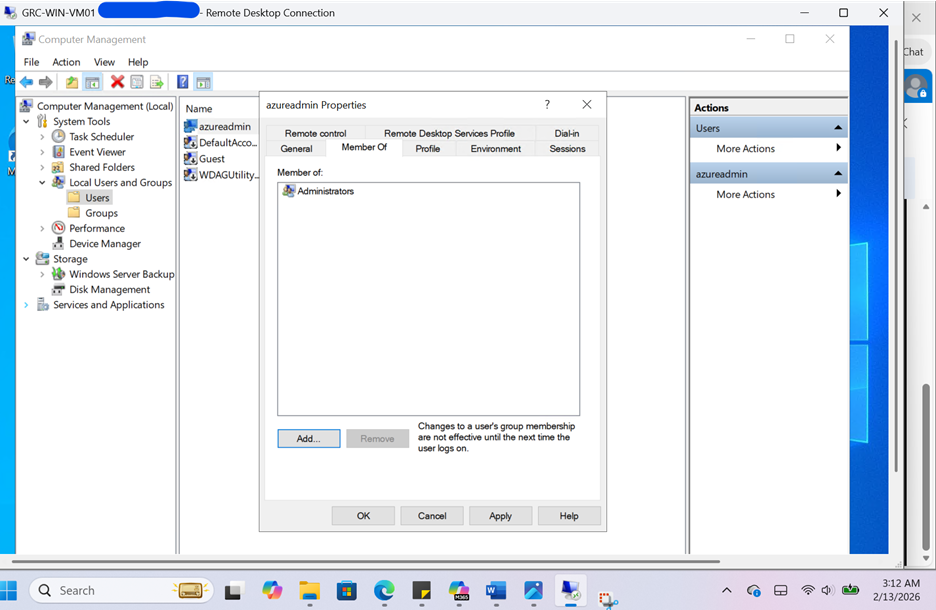
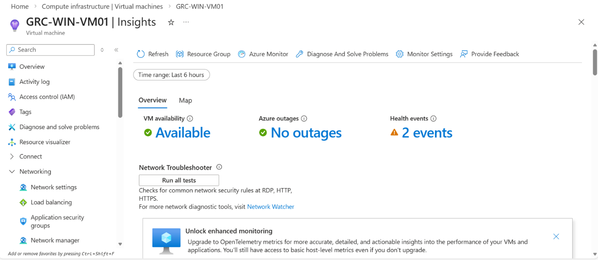
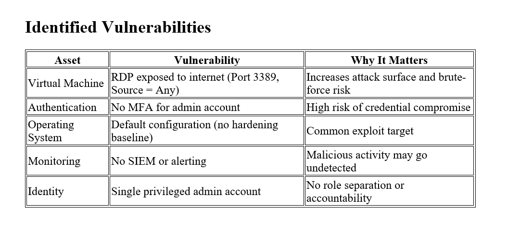
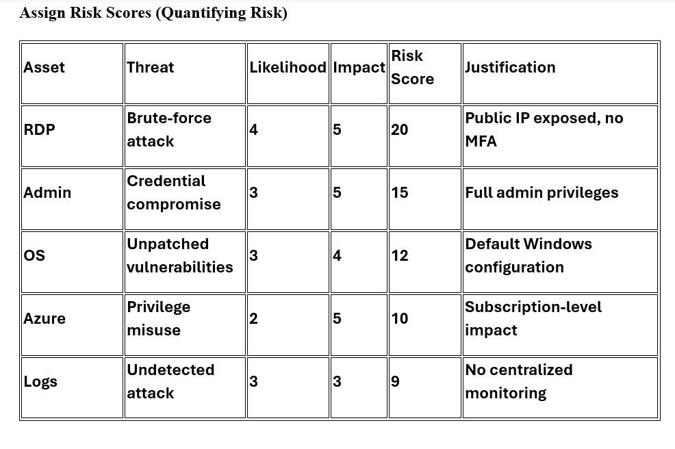
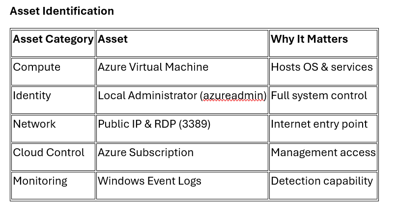
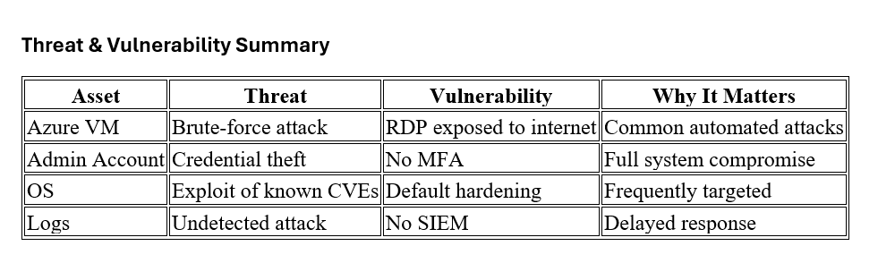

# Cloud Security Risk Assessment & GRC Simulation (Azure)
## 1. Governance Structure
A dedicated Azure Resource Group named **GRC-Lab** was created to logically isolate and manage all lab assets. 

This enables:
- Centralized policy enforcement  
- Role-based access control (RBAC) management  
- Resource scoping and governance boundary definition  
- Cost tracking and accountability  

## 2. Azure Virtual Machine Deployment Configuration

The virtual machine (**GRC-WIN-VM01**) was deployed in the Central US region using **Windows Server 2022 Datacenter**.

The configuration intentionally allows public RDP access to simulate a realistic cloud exposure scenario for structured risk assessment purposes.

## 3. Vulnerability Assessment

The Network Security Group (NSG) allows inbound TCP traffic on port **3389 (RDP)** from **Source = Any**.

This configuration exposes the administrative interface of the virtual machine to the public internet, significantly increasing the likelihood of brute-force attacks and unauthorized access attempts.

### Remote Access Configuration (RDP Exposure)

The Azure Native RDP connection interface confirms that:

- A public IP address is assigned
- Port 3389 (RDP) is accessible
- A local administrative username is configured
- Native RDP is the active access method
- NSG rules permit the connection

This confirms that the exposure is operational, not theoretical.

## 2. Asset Identification

### Primary Asset

**Azure Virtual Machine (GRC-WIN-VM01)**

- Region: Central US  
- Public IP enabled  
- RDP (3389) exposed  
- OS: Windows Server 2022  

### Why Critical?

This virtual machine represents the primary compute workload of the environment. It hosts the operating system and services that are directly exposed to the internet.

### If Compromised:

- Full system control lost  
- Potential data theft  
- Malware deployment  
- Lateral movement risk  
### Supporting Asset

#### Operating System – Windows Server 2022 Datacenter

- Contains system configurations  
- Controls authentication  
- Manages system services  

### If Compromised:

- Privilege escalation  
- Credential harvesting  
- Persistence mechanisms  
#### Administrator Account – Local Admin (azureadmin)

This account has full administrative privileges over the virtual machine and represents a high-value target for attackers.

### If Compromised:

- Full remote system control  
- Privilege escalation capabilities  
- Backdoor or persistent access installation  
- Lateral movement to other connected resources  
#### Public IP Address

The public IP address assigned to the virtual machine enables external connectivity and remote management. While necessary for accessibility in this lab scenario, it significantly increases the attack surface.

### Risk Exposure:

- Internet-wide brute-force attempts  
- Automated bot scanning and enumeration  
- Exploit attempts targeting exposed services (e.g., RDP on TCP 3389)  
- Increased likelihood of reconnaissance activity  
#### Network Security Group (NSG)

The Network Security Group (NSG) enforces inbound and outbound traffic rules at the VM network interface level. It acts as the primary network-layer security control governing exposure to the internet.

In this lab configuration, the NSG allows inbound TCP 3389 (RDP) from “Any” source, creating intentional exposure for risk assessment simulation.

### Risk if Misconfigured:

- Unrestricted administrative access from the public internet  
- Increased likelihood of brute-force and credential stuffing attacks  
- Potential data exfiltration through permissive outbound rules  
- Expanded attack surface due to overly broad source/destination rules  
- Reduced segmentation and lack of network-level defense-in-depth  
#### Virtual Network (VNet) & Subnet

The Azure Virtual Network (VNet) provides logical network isolation within the cloud environment. It defines IP address space, subnets, and segmentation boundaries for deployed resources.

The GRC-WIN-VM01 virtual machine is deployed within a designated subnet inside the VNet, which controls internal routing and communication behavior.

### Security Function
- Provides logical isolation and segmentation boundaries  
- Enables network-layer controls (NSGs, firewalls, routing rules)  
- Supports defense-in-depth through subnet-level restrictions  

### Risk if Poorly Segmented or Compromised
- Lateral movement across internal cloud resources  
- Increased blast radius during compromise  
- Potential pivoting to other connected systems (real-world scenario)

**Figure – Azure Virtual Machine Overview (Primary Asset Context)**  
Azure portal overview showing VM status, region, resource group, public IP association, and VNet/subnet placement.

### Figure 2 – Operating System Configuration (Windows Server 2022 Datacenter)

### Figure 3 – NSG Inbound Rule Allowing RDP (3389) from Any Source

### Figure 1 – Azure NSG Inbound Rule Showing Publicly Exposed RDP (Port 3389)

### Externally Accessible Service Identified

The following externally accessible service was identified:

- **Service:** Remote Desktop Protocol (RDP)  
- **Port:** 3389  
- **Protocol:** TCP  
- **Exposure:** Public (Source = Any)  
- **Risk:** Increased likelihood of brute-force attacks, credential stuffing, and unauthorized remote access attempts.
### Privileged Accounts Identified

The following privileged account was identified on the VM:

- **Account Name:** azureadmin  
- **Status:** Enabled  
- **Privilege Level:** Local Administrator  

#### Risk Observation:
The presence of an enabled administrator account increases the risk of full system compromise if credentials are exposed or brute-forced.

#### Risk Rating:
- **Likelihood:** 3  
- **Impact:** 5  
- **Overall Risk:** High  

### Figure 1 – Privileged Account Enumeration via Run Command Script

## 3. Threat Identification
### Figure 1 – Identified Threat Scenarios Across Key Azure Assets

## 4. Vulnerability Identified

The Network Security Group (NSG) allows inbound RDP (TCP port 3389) from **Source = Any** with action set to **Allow**.  
This configuration exposes the virtual machine to the public internet and significantly increases the likelihood of:

- Brute-force login attempts  
- Credential stuffing attacks  
- Unauthorized remote access

## 5. OS-Level Privileged Account Validation

The local administrator account **azureadmin** was confirmed to exist on the virtual machine.  
This account is a member of the local **Administrators** group, granting full system control.

Since this account is accessible via RDP and uses password-based authentication, it represents a high-value identity asset and potential attack target.

### Identified Privileged Account

- **Account:** azureadmin  
- **Group Membership:** Administrators  
- **Privilege Level:** Full system control  

### Realistic Threat Scenario

If public RDP (TCP port 3389) is exposed to the internet, attackers may conduct brute-force login attempts against the **azureadmin** account.

If successful, the attacker could:

- Gain full administrative access  
- Disable security controls  
- Install malware  
- Exfiltrate sensitive data  
- Use the VM for malicious activity

## 6. Azure Monitoring Status

Azure monitoring is enabled through Azure Insights.  
Basic performance metrics (CPU, availability, memory) are visible.

### Security Importance:

- Enables visibility into system health  
- Helps detect abnormal resource usage  
- Supports incident response  

### Risk if disabled:

- Attacks could go unnoticed  
- No performance or anomaly visibility  

**Azure Insights Overview Dashboard (VM Availability & Health Status)**

**Azure Monitoring Metrics (CPU Utilization & Resource Availability)**

### Azure Monitoring

Azure Insights is enabled. VM availability and performance metrics (CPU, memory) are visible, indicating that basic monitoring capabilities are active.

### OS-Level Logging

Windows Security logs are being generated in Event Viewer, confirming that system activity (logons, processes, etc.) is being recorded.
**Windows Security Logs (Event Viewer)**

### Risk Consideration

If monitoring were disabled, malicious activity (e.g., brute-force RDP attempts, privilege escalation) could go undetected.
### Identified Vulnerabilities Across Azure VM Environment

### Quantified Risk Scoring Model (Likelihood × Impact)

### Control Mapping & Framework Alignment (CIS v8 / NIST CSF)

## Executive Summary

This report presents the results of a cloud security risk assessment conducted on a Microsoft Azure-hosted Windows Server 2022 virtual machine (**GRC-WIN-VM01**).

The objective was to:
- Identify key assets  
- Assess realistic threat scenarios  
- Evaluate vulnerabilities  
- Quantify risks using a likelihood × impact model  
- Map mitigation controls to recognized frameworks such as **NIST CSF** and **CIS Controls**

The assessment identified several medium-to-high risks, primarily related to:
- Public RDP exposure  
- Lack of multi-factor authentication (MFA)  
- Default operating system hardening  
- Limited centralized monitoring

### Azure Environment Details Overview (GRC-WIN-VM01)

### Asset Identification Matrix for Azure VM Environment

### Threat & Vulnerability Summary for Azure VM Environment

### Quantified Risk Register for Azure VM Environment

### Control Mapping & Framework Alignment (CIS v8 / NIST CSF)

